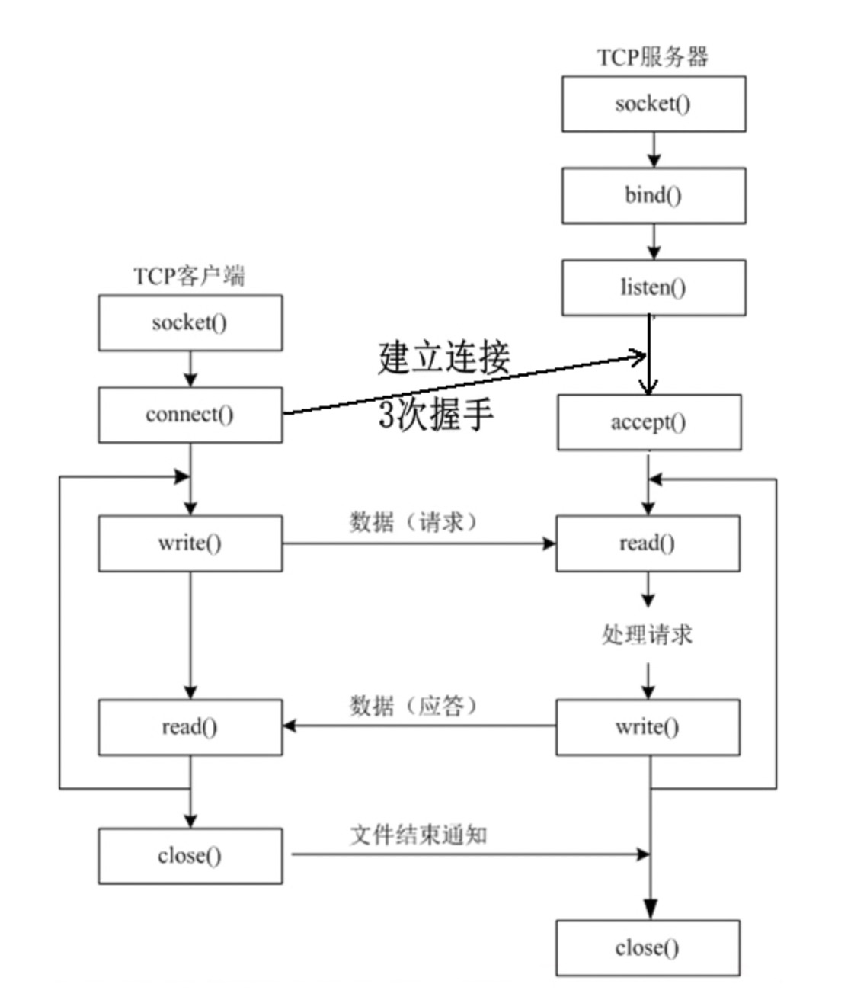
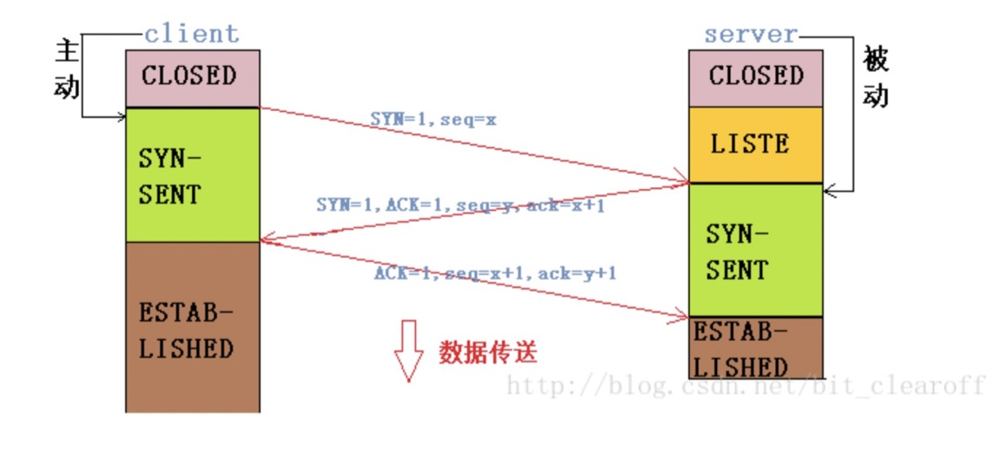
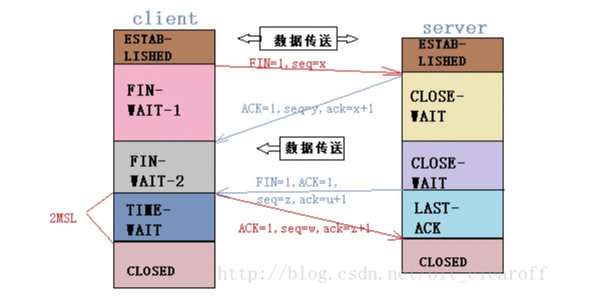
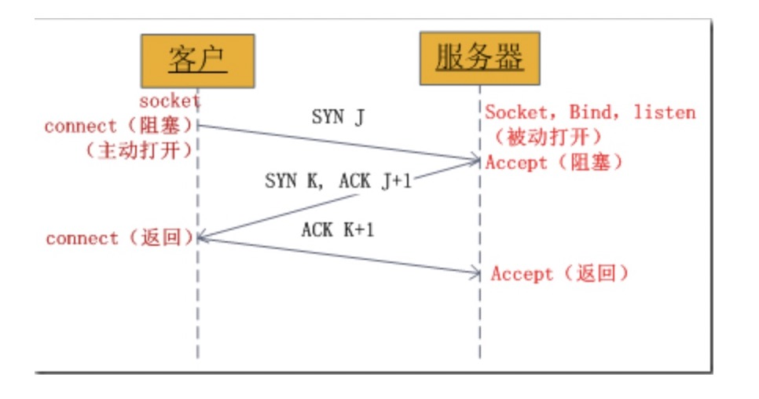
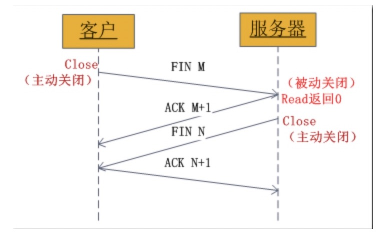

### 基于TCP网络编程


### 1、socket的基本操作
既然socket是“open—write/read—close”模式的一种实现，那么socket就提供了这些操作对应的函数接口。下面以TCP为例，介绍几个基本的socket接口函数。
 生成套接字，主要有3个参数：通信的目的IP地址、使用的传输 层协议(TCP或UDP)和使用的端口号。Socket原意是“插座”。通过将这3个参数结合起来，与一个“插座”Socket绑定，应用层就可以和传输 层通过套接字接口，区分来自不同应用程序进程或网络连接的通信，实现数据传输的并发服务。
#### （1）socket()函数
```
int socket(int domain, int type, int protocol);
```
socket函数对应于普通文件的打开操作。普通文件的打开操作返回一个文件描述字，而socket()用于创建一个socket描述符（socket descriptor），它唯一标识一个socket。这个socket描述字跟文件描述字一样，后续的操作都有用到它，把它作为参数，通过它来进行一些读写操作。

正如可以给fopen的传入不同参数值，以打开不同的文件。创建socket的时候，也可以指定不同的参数创建不同的socket描述符，socket函数的三个参数分别为：

domain：即协议域，又称为协议族（family）。常用的协议族有，AF_INET、AF_INET6、AF_LOCAL（或称AF_UNIX，Unix域socket）、AF_ROUTE等等。协议族决定了socket的地址类型，在通信中必须采用对应的地址，如AF_INET决定了要用ipv4地址（32位的）与端口号（16位的）的组合、AF_UNIX决定了要用一个绝对路径名作为地址。
type：指定socket类型。常用的socket类型有，SOCK_STREAM、SOCK_DGRAM、SOCK_RAW、SOCK_PACKET、SOCK_SEQPACKET等等（socket的类型有哪些？）。
protocol：故名思意，就是指定协议。常用的协议有，IPPROTO_TCP、IPPTOTO_UDP、IPPROTO_SCTP、IPPROTO_TIPC等，它们分别对应TCP传输协议、UDP传输协议、STCP传输协议、TIPC传输协议（这个协议我将会单独开篇讨论！）。
注意：并不是上面的type和protocol可以随意组合的，如SOCK_STREAM不可以跟IPPROTO_UDP组合。当protocol为0时，会自动选择type类型对应的默认协议。

当我们调用socket创建一个socket时，返回的socket描述字它存在于协议族（address family，AF_XXX）空间中，但没有一个具体的地址。如果想要给它赋值一个地址，就必须调用bind()函数，否则就当调用connect()、listen()时系统会自动随机分配一个端口。

#### 2、bind()函数
正如上面所说bind()函数把一个地址族中的特定地址赋给socket。例如对应AF_INET、AF_INET6就是把一个ipv4或ipv6地址和端口号组合赋给socket。

int bind(int sockfd, const struct sockaddr *addr, socklen_t addrlen);
函数的三个参数分别为：

sockfd：即socket描述字，它是通过socket()函数创建了，唯一标识一个socket。bind()函数就是将给这个描述字绑定一个名字。
addr：一个const struct sockaddr*指针，指向要绑定给sockfd的协议地址。这个地址结构根据地址创建socket时的地址协议族的不同而不同。
addrlen：对应的是地址的长度
#### 3、listen()、connect()函数
如果作为一个服务器，在调用socket()、bind()之后就会调用listen()来监听这个socket，如果客户端这时调用connect()发出连接请求，服务器端就会接收到这个请求。

int listen(int sockfd, int backlog);
int connect(int sockfd, const struct sockaddr *addr, socklen_t addrlen);
listen函数的第一个参数即为要监听的socket描述字，第二个参数为相应socket可以排队的最大连接个数。socket()函数创建的socket默认是一个主动类型的，listen函数将socket变为被动类型的，等待客户的连接请求。

connect函数的第一个参数即为客户端的socket描述字，第二参数为服务器的socket地址，第三个参数为socket地址的长度。客户端通过调用connect函数来建立与TCP服务器的连接。
#### 4、accept()函数
TCP服务器端依次调用socket()、bind()、listen()之后，就会监听指定的socket地址了。TCP客户端依次调用socket()、connect()之后就想TCP服务器发送了一个连接请求。TCP服务器监听到这个请求之后，就会调用accept()函数取接收请求，这样连接就建立好了。之后就可以开始网络I/O操作了，即类同于普通文件的读写I/O操作。

int accept(int sockfd, struct sockaddr *addr, socklen_t *addrlen);
accept函数的第一个参数为服务器的socket描述字，第二个参数为指向struct sockaddr *的指针，用于返回客户端的协议地址，第三个参数为协议地址的长度。如果accpet成功，那么其返回值是由内核自动生成的一个全新的描述字，代表与返回客户的TCP连接。

注意：accept的第一个参数为服务器的socket描述字，是服务器开始调用socket()函数生成的，称为监听socket描述字；而accept函数返回的是已连接的socket描述字。一个服务器通常通常仅仅只创建一个监听socket描述字，它在该服务器的生命周期内一直存在。内核为每个由服务器进程接受的客户连接创建了一个已连接socket描述字，当服务器完成了对某个客户的服务，相应的已连接socket描述字就被关闭。
#### 5、close()函数
在服务器与客户端建立连接之后，会进行一些读写操作，完成了读写操作就要关闭相应的socket描述字，好比操作完打开的文件要调用fclose关闭打开的文件。
```
#include <unistd.h>
int close(int fd);
```
close一个TCP socket的缺省行为时把该socket标记为以关闭，然后立即返回到调用进程。该描述字不能再由调用进程使用，也就是说不能再作为read或write的第一个参数。

注意：close操作只是使相应socket描述字的引用计数-1，只有当引用计数为0的时候，才会触发TCP客户端向服务器发送终止连接请求。


### 2、TCP 三次握手和四次挥手
https://blog.csdn.net/tennysonsky/article/details/45622395
为什么建立连接协议是三次握手，而关闭连接却是四次握手呢？

这是因为服务端的 LISTEN 状态下的 SOCKET 当收到 SYN 报文的建连请求后，它可以把 ACK 和 SYN（ACK 起应答作用，而 SYN 起同步作用）放在一个报文里来发送。但关闭连接时，当收到对方的 FIN 报文通知时，它仅仅表示对方没有数据发送给你了，但是你还可以给对方发送数据，也有这么种可能，你还有一些数据在传给对方的途中，所以你不能立马关闭连接,也即你可能还需要把在传输途中的数据给对方之后，又或者，你还有一些数据需要传输给对方后，（再关闭连接）再发送FIN 报文给对方来表示你同意现在可以关闭连接了，所以它这里的 ACK 报文和 FIN 报文多数情况下都是分开发送的。

### 3、https://blog.csdn.net/lvyuan30276/article/details/50458572

### 4、网络字节序与主机字节序
https://www.cnblogs.com/suntp/p/6434644.html
主机字节序就是我们平常说的大端和小端模式：不同的CPU有不同的字节序类型，这些字节序是指整数在内存中保存的顺序，这个叫做主机序。引用标准的Big-Endian和Little-Endian的定义如下：

　　a) Little-Endian就是低位字节排放在内存的低地址端，高位字节排放在内存的高地址端。

　　b) Big-Endian就是高位字节排放在内存的低地址端，低位字节排放在内存的高地址端。

网络字节序：4个字节的32 bit值以下面的次序传输：首先是0～7bit，其次8～15bit，然后16～23bit，最后是24~31bit。这种传输次序称作大端字节序。由于TCP/IP首部中所有的二进制整数在网络中传输时都要求以这种次序，因此它又称作网络字节序。字节序，顾名思义字节的顺序，就是大于一个字节类型的数据在内存中的存放顺序，一个字节的数据没有顺序的问题了。

**所以：在将一个地址绑定到socket的时候，请先将主机字节序转换成为网络字节序**，而不要假定主机字节序跟网络字节序一样使用的是Big-Endian。由于这个问题曾引发过血案！公司项目代码中由于存在这个问题，导致了很多莫名其妙的问题，所以请谨记对主机字节序不要做任何假定，务必将其转化为网络字节序再赋给socket。

### 5、tcp建立连接要进行“三次握手”

下来是四次挥手过程


即交换三个分组。大致流程如下：

客户端向服务器发送一个SYN J
服务器向客户端响应一个SYN K，并对SYN J进行确认ACK J+1
客户端再想服务器发一个确认ACK K+1
只有就完了三次握手，但是这个三次握手发生在socket的那几个函数中呢？请看下图：



图1、socket中发送的TCP三次握手

从图中可以看出，当客户端调用connect时，触发了连接请求，向服务器发送了SYN J包，这时connect进入阻塞状态；服务器监听到连接请求，即收到SYN J包，调用accept函数接收请求向客户端发送SYN K ，ACK J+1，这时accept进入阻塞状态；客户端收到服务器的SYN K ，ACK J+1之后，这时connect返回，并对SYN K进行确认；服务器收到ACK K+1时，accept返回，至此三次握手完毕，连接建立。

### 6、socket中TCP的四次挥手释放连接详解

图示过程如下：

（1）某个应用进程首先调用close主动关闭连接，这时TCP发送一个FIN M；
（2）另一端接收到FINM之后，执行被动关闭，对这个FIN进行确认。它的接收也作为文件结束符传递给应用进程，因为FIN的接收意味着应用进程在相应的连接上再也接收不到额外数据；
（3）一段时间之后，接收到文件结束符的应用进程调用close关闭它的socket。这导致它的TCP也发送一个FIN N；
（4）接收到这个FIN的源发送端TCP对它进行确认。
这样每个方向上都有一个FIN和ACK。


### ACK机制是怎么工作的：


数据丢失或延迟。发送方发送数据seq时会起一个定时器，如果在指定时间内没有接收到ACK seq + 1，就把数据seq再发一次。

数据乱序。接收方上一个收到的正确数据是seq + 4，它返回seq + 5作为ACK。这时候它收到了seq + 7，因为顺序错了，所以接收方会再次返回seq + 5给发送方。

数据错误。每一个TCP数据都会带着数据的校验和。接收方收到数据seq + 3以后会先对校验和进行验证。如果结果不对，则发送ACK seq + 3，让发送方重新发送数据。

数据重复。接收方直接丢弃重复的数据即可。


time_wait状态如何产生？ 
由上面的变迁图，首先调用close()发起主动关闭的一方，在发送最后一个ACK之后会进入time_wait的状态，也就说该发送方会保持2MSL时间之后才会回到初始状态。MSL值得是数据包在网络中的最大生存时间。产生这种结果使得这个TCP连接在2MSL连接等待期间，定义这个连接的四元组（客户端IP地址和端口，服务端IP地址和端口号）不能被使用。

### 附录：Python中用TCP协议进行Socket编程
对于客户端，要主动连接服务器的IP和指定端口，对于服务器，要首先监听指定端口，然后，对每一个新的连接，创建一个线程或进程来处理。通常，服务器程序会无限运行下去。

同一个端口，被一个Socket绑定了以后，就不能被别的Socket绑定了。
```
# server.py
import socket
import threading
import time
def tcplink(sock, addr):
    print('Accept new connection from %s:%s...' % addr)
    sock.send(b'Welcome!')
    while True:
        data = sock.recv(1024)
        time.sleep(1)
        if not data or data.decode('utf-8') == 'exit':
            break
        sock.send(('Hello, %s!' % data.decode('utf-8')).encode('utf-8'))
    sock.close()
    print('Connection from %s:%s closed.' % addr)

s = socket.socket(socket.AF_INET, socket.SOCK_STREAM)
s.bind(('127.0.0.1', 9999))
s.listen(5)
print('Waiting for connection...')
while True:
    # 接受一个新连接:
    sock, addr = s.accept()
    # 创建新线程来处理TCP连接:
    # 每个连接都必须创建新线程（或进程）来处理，否则，单线程在处理连接的过程中，无法接受其他客户端的连接：
    t = threading.Thread(target=tcplink, args=(sock, addr))
    t.start()


```
```
# client.py
import socket
# 创建Socket时，AF_INET指定使用IPv4协议，如果要用更先进的IPv6，就指定为AF_INET6。
# SOCK_STREAM指定使用面向流的TCP协议，这样，一个Socket对象就创建成功，但是还没有建立连接。
s = socket.socket(socket.AF_INET, socket.SOCK_STREAM)
# 建立连接:
s.connect(('127.0.0.1', 9999))
# 接收欢迎消息:
# 接收数据时，调用recv(max)方法，一次最多接收指定的字节数，
# 因此，在一个while循环中反复接收，直到recv()返回空数据，表示接收完毕，退出循环。
print(s.recv(1024).decode('utf-8'))
for data in [b'Michael', b'Tracy', b'Sarah']:
    # 发送数据:
    s.send(data)
    print(s.recv(1024).decode('utf-8'))
s.send(b'exit')
s.close()
```
